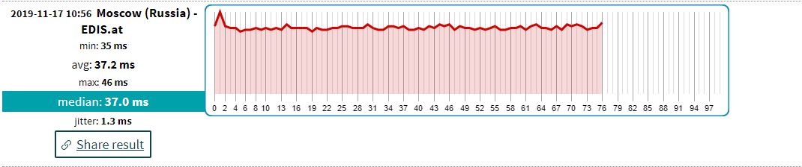

## Hypothesis
* The longer the distances to the server is, the worse will the repsonse time get. 

## Experiment
* We use <strong>https://www.meter.net/ping-test/</strong> to performe ping test to see how the distance changes the delay between the different servers. Our starting point is the copenhagen so all measurements starting from here to the destination.

### Their definition of the test:
* What is ping: ping is method to measure minimum time needed to send smallest possible amount of data and receive response. For ping test are used ms units (1000 miliseconds = 1 second). Usual values for optics of cable connection is 5-20ms. Wireless (2.4Ghz, 5Ghz,..) close to 30ms. Mobile connection is much worse >100ms.
Ping value affects most gaming over internet and internet telephony (skype). Less is better, reasonable value is lower than 50ms.
  
Above every picture is a approximate distance calculated on google maps with a bird distance, so basicly the shortest distance possible.

We start off with a server in <strong>Frankfurt</strong> (Distance 667,11 km)

We can see that the average response time is 23ms which is an good connection if we look at the diffenition on  <strong>https://www.meter.net/ping-test/</strong> that says that reasonable values are lower than 50.

We then head to <strong>Paris</strong> in France (Distance 1.022,58 km)

We can see that the destination is further away and our time measurements are higher just as we expected from our hypothesis, our connection is still good though, so we could use a single server to serve these two cities.

We then head to <strong>Vancouver</strong> in Canada (Distance 7.646,07 km)
 
First big thing to notice is that the graph is very short compared to the above, but if we look at the values of the ping measurement it makes sense, since the average ping time is 169.11 which is 7 times slower than the one in frankfurt, it cant take as many ping measurements in the time that the test is runnig, since it is running on a timeslot and not amount of times.

Then USA eastcoast <strong>Miami</strong> (Distance 7.832,29 km)
 
We can see to the above that the distance is almost the same but the ping measurement is lower, this is properly because it is the distance in bird flight and not the actual route that the ping package is going. Another reason we take the ping measurement multiple times is that the package can take different routes so to get an average is alot more precise than just a single measurement

Then USA westcoast <strong>San Francisco</strong> (Distance 8.787,65 km)
 

Then Russia <strong>Moscow</strong> (Distance 1.554,85 km)
 

Then Australia <strong>Sydney</strong> (Distance 16.030,48 km)
  
